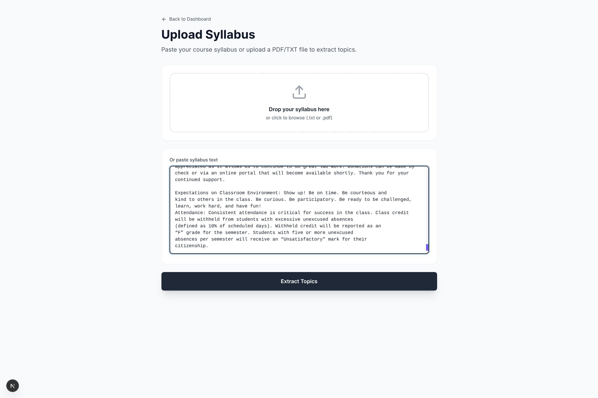
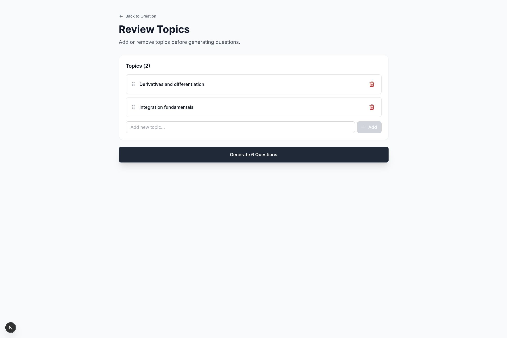
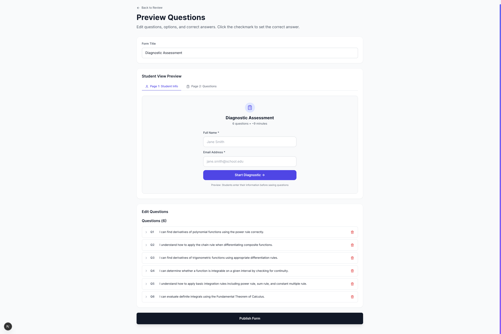
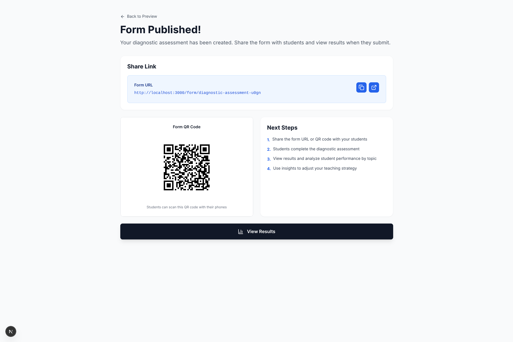
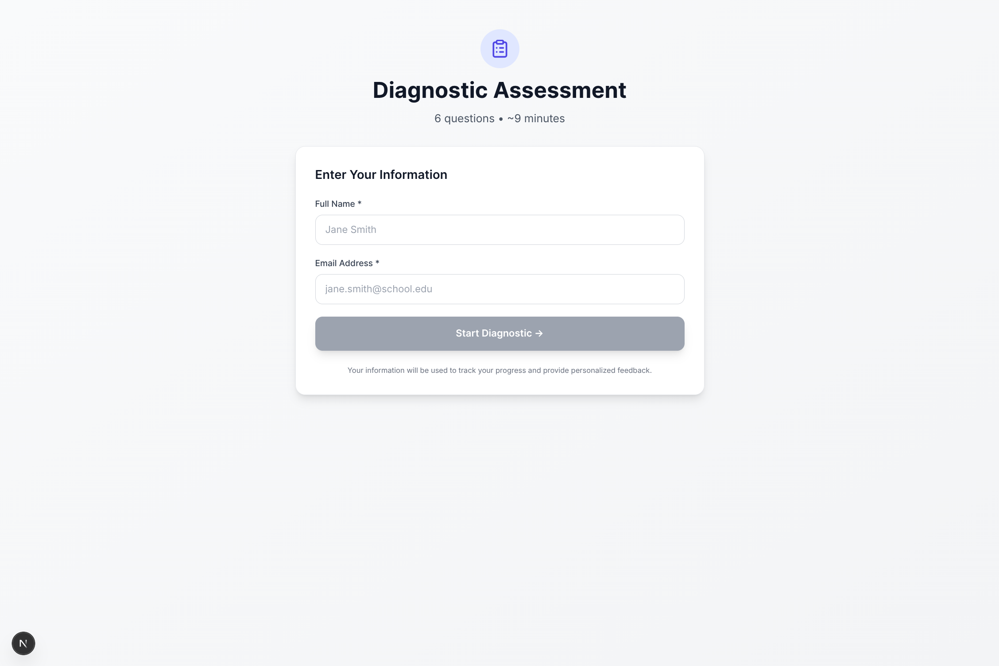
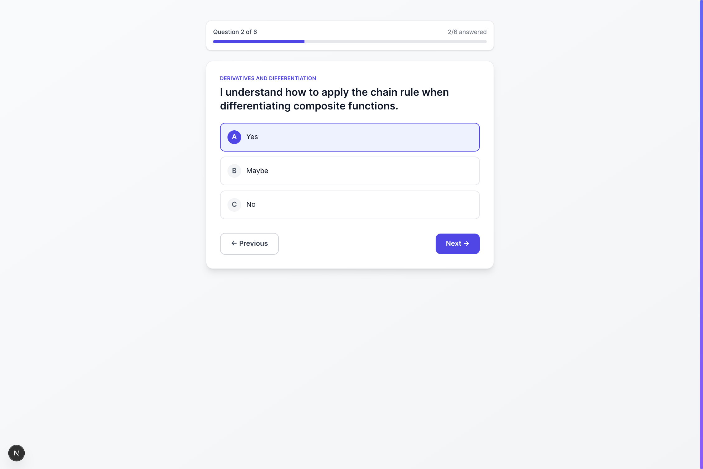
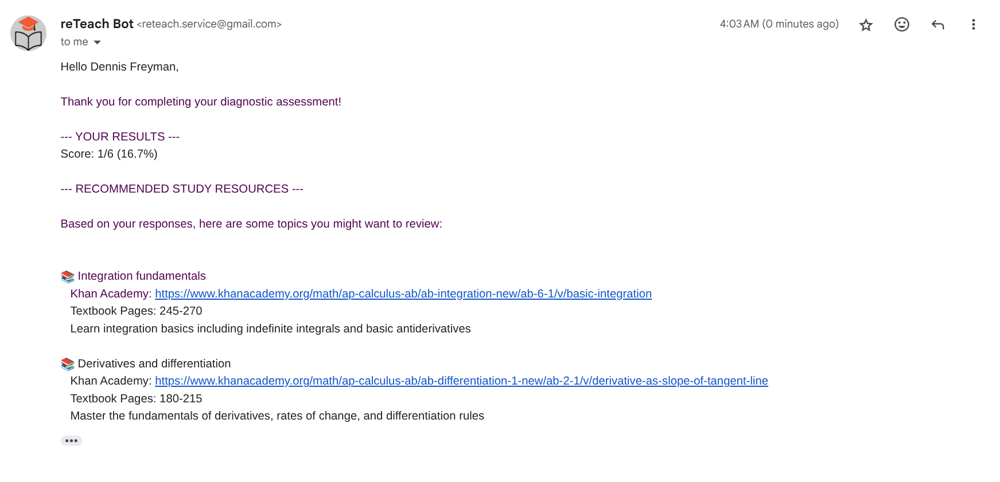
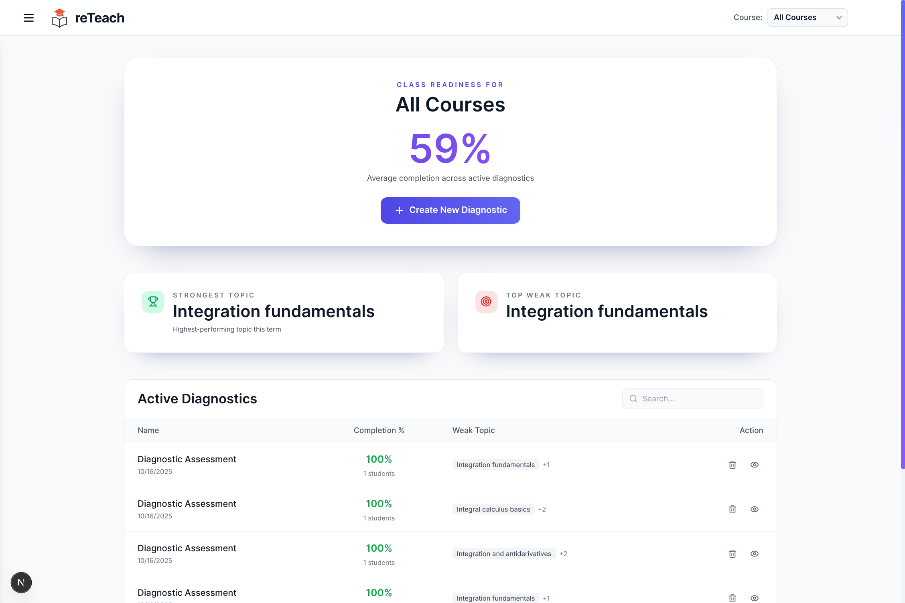
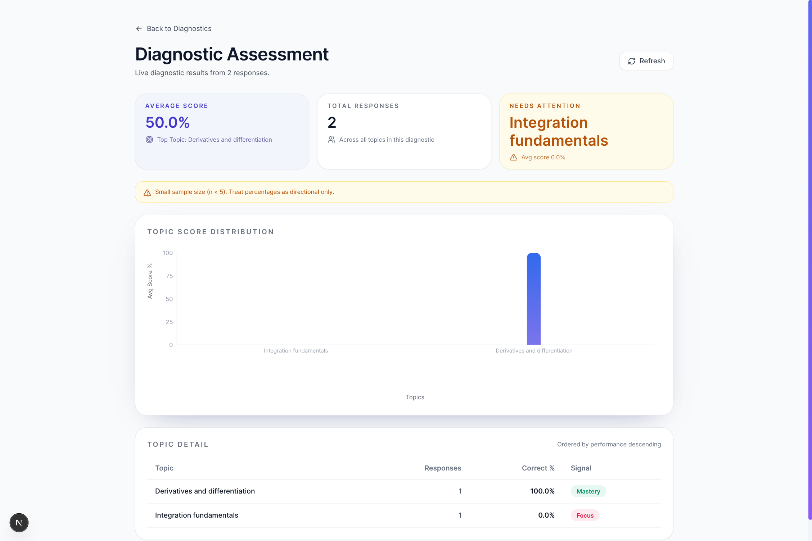

# reTeach

[](https://nextjs.org/)
[](https://fastapi.tiangolo.com/)
[](https://github.com/Abk2162/reTeach)
[](https://opensource.org/licenses/MIT)

### AI-Powered Personalized Learning Platform

Transform your course syllabus into personalized diagnostic assessments in minutes. Using AI, reTeach generates topic-specific questions, analyzes student performance, and creates customized study plans.

---

## ✨ Features

- 🤖 **AI-Powered Question Generation** - Automatically creates diagnostic questions from your syllabus
- 📊 **Real-Time Analytics** - Track student performance by topic with interactive dashboards
- 📚 **Automated Study Resources** - Students receive personalized Khan Academy links for weak topics
- 🎯 **Topic-Based Analysis** - Identify knowledge gaps across your entire course
- 🔗 **Easy Sharing** - Share assessments via link or QR code
- 📱 **Mobile Friendly** - Works seamlessly on any device

---

## 🚀 Workflow

### 1. Upload Syllabus & Extract Topics

Upload your course syllabus and let AI extract the main topics and structure.



---

### 2. Review Topics

Review and customize the extracted topics before generating questions.



---

### 3. Preview Questions

AI generates 3 questions per topic. Review and edit as needed.



---

### 4. Publish & Share

Publish your diagnostic and share it with students via link or QR code.



---

### 5. Student Experience

Students complete the assessment with a clean, simple interface.





---

### 6. Automated Feedback

Students receive personalized study resources via email immediately after submission.



---

### 7. View Results

Access comprehensive analytics showing performance by topic and identifying weak areas.





---

## 🛠️ Technology Stack

**Frontend**
- Next.js 15
- TypeScript
- Tailwind CSS
- Recharts

**Backend**
- FastAPI (Python)
- Supabase (PostgreSQL)
- Google Gemini 2.0 Flash
- SendGrid / SMTP

---

## ⚡ Quick Start

### Prerequisites

- Node.js 18+
- Python 3.10+
- Accounts: Supabase, Google AI Studio, SendGrid (or Gmail)

### Local Development

**1. Clone and Install**
```bash
git clone https://github.com/Abk2162/reTeach.git
cd reTeach

# Install frontend dependencies
npm install

# Install backend dependencies
cd backend
python -m venv venv
source venv/bin/activate  # On Windows: venv\Scripts\activate
pip install -r requirements.txt
cd ..
```

**2. Configure Environment**
```bash
# Copy example files
cp .env.example .env.local
cp backend/.env.example backend/.env

# Edit .env.local and backend/.env with your credentials
# See Environment Variables section below
```

**3. Set Up Database**
```bash
# Run SQL migrations in your Supabase SQL Editor
# Files located in: backend/migrations/*.sql
```

**4. Start Development Servers**
```bash
# Terminal 1: Start backend
cd backend
source venv/bin/activate  # On Windows: venv\Scripts\activate
uvicorn app.main:app --reload --port 8000

# Terminal 2: Start frontend
npm run dev
```

Visit [http://localhost:3000](http://localhost:3000)

---

## 🔐 Environment Variables

### Frontend (`.env.local`)

```bash
# Supabase
NEXT_PUBLIC_SUPABASE_URL=your_supabase_url
NEXT_PUBLIC_SUPABASE_ANON_KEY=your_supabase_anon_key

# Backend API
NEXT_PUBLIC_BACKEND_URL=http://localhost:8000

# NextAuth
NEXTAUTH_SECRET=your_32_char_random_string
NEXTAUTH_URL=http://localhost:3000
```

### Backend (`backend/.env`)

```bash
# Supabase
SUPABASE_URL=your_supabase_url
SUPABASE_KEY=your_supabase_anon_key

# Google AI
GOOGLE_API_KEY=your_gemini_api_key

# SendGrid (recommended)
SENDGRID_API_KEY=your_sendgrid_key
FROM_EMAIL=your_verified_email@domain.com

# OR Gmail SMTP (development only)
# BOT_EMAIL=your_email@gmail.com
# BOT_PASSWORD=your_app_password

# Application
FRONTEND_URL=http://localhost:3000
CORS_ORIGINS=http://localhost:3000
ENVIRONMENT=development
DEBUG=true
```

📖 See `.env.example` files for detailed instructions

---


---

## 📁 Project Structure

```
reTeach/
├── src/                    # Next.js frontend
│   ├── app/               # App router pages
│   ├── components/        # React components
│   └── lib/              # Utilities & API client
├── backend/               # FastAPI backend
│   └── app/
│       ├── routers/      # API endpoints
│       ├── services/     # Business logic
│       ├── models/       # Data models
│       └── utils/        # Helpers
├── public/               # Static assets
├── docs/                 # Documentation & images
├── .env.example          # Frontend env template
└── backend/.env.example  # Backend env template
```

---

## 🤝 Contributing

We welcome contributions! Please:

1. Fork the repository
2. Create a feature branch (`git checkout -b feature/AmazingFeature`)
3. Commit your changes (`git commit -m 'Add some AmazingFeature'`)
4. Push to the branch (`git push origin feature/AmazingFeature`)
5. Open a Pull Request

---

## 📄 License

This project is licensed under the MIT License - see the [LICENSE](LICENSE) file for details.

---

## 💡 Roadmap

- [ ] Multi-language support
- [ ] Advanced analytics with ML insights
- [ ] Integration with Google Classroom
- [ ] Mobile app (React Native)
- [ ] Gamification features
- [ ] Accessibility improvements (WCAG 2.1 AA)

---

## 📞 Support

- 🐛 Bug Reports: [GitHub Issues](https://github.com/Abk2162/reTeach/issues)
- 💬 Discussions: [GitHub Discussions](https://github.com/Abk2162/reTeach/discussions)
- 📧 Email: [alicenderqandy@gmail.com](mailto:alicenderqandy@gmail.com)

---

**Built with ❤️ by Ch Abhinav, Abhijay, Rayhan & Chetan T**

© 2025 reTeach. All rights reserved.